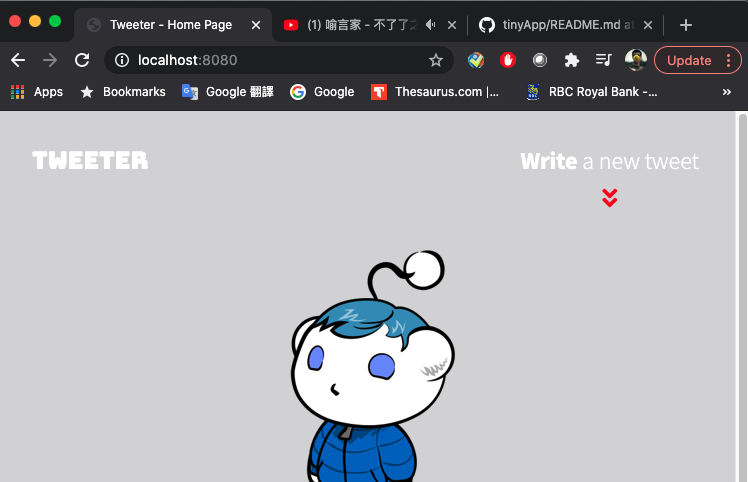

# Tweeter Project

Tweeter is a simple, single-page Twitter clone. HTML, CSS, JS, jQuery and AJAX are used for the front end. The back end is pre-made with Node, Express, and MongoDB.

## Final Product

1. Display features

- Navigation bar is fixed to the top, and when the screen width smaller than 800px, it will merge with header
  
- Conpose tweet box is displayed above the list of tweets
  
- Individual tweets are displayed reverse-chronologically
  

2. Behaviour

- Character Counter. Will display the remaining number of character allowed (140) in the textarea.
  

- When more than 140 characters have been typed into compose tweet box, with will turn red, and show how may characters over the 140 limit have been typed.
  

- compose tweet. When user submits an invalid tweet, error message is displayed
  
  

- When a valid tweet submitted, tweets will refresh, the compose tweet textarea is cleared, and counter reset
  

3. Stretch and extra features

- Toggle form. The red arrow sign underneath the wirte a new tweet is animated, and when you click it, the compose tweet section will toggle back and forth.
  

- Hover effects over tweets. when you hover a tweet, it will 'pop-up' and the blur effect is cleared
  

## Getting Started

1. Fork this repository, then clone your fork of this repository.
2. Install dependencies using the `npm install` command.
3. Start the web server using the `npm run local` command. The app will be served at <http://localhost:8080/>.
4. Go to <http://localhost:8080/> in your browser.

## Dependencies

- Express
- Node 5.10.x or above
- Nodemon
- cors
- body-parser
